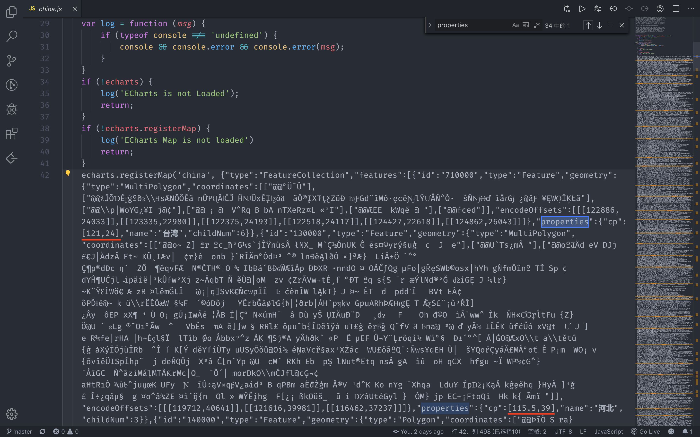

# 中国省份问问答

## 说明

GitHub 仓库：[https://github.com/RedrockTeam/province-qa](https://github.com/RedrockTeam/province-qa)

部署地址：[https://wx.redrock.team/game/province-qaq/](https://wx.redrock.team/game/province-qaq/)

## 整体结构

```
src
├── App.jsx
├── assets
│   ├── china.js // Echarts 库中的中国地图相关，用于修改省份标签（label）坐标
│   ├── fonts
│   │   └── ...
│   └── images
│       └── ...
├── components // 组件
│   ├── Board.jsx // 排名用户信息
│   ├── ChinaMap.jsx // 中国地图省份选择组件
│   ├── GradeDialog.jsx // 答完题的成绩弹窗
│   ├── Introduction.jsx // 第一次打开省份时的介绍
│   ├── LimitDialog.jsx // 每天答题次数限制的弹窗
│   ├── RankUser.jsx // 排名一个用户信息
│   ├── UserInfo.jsx // 用户个人信息
│   └── base // 多次复用的基础组件
│       ├── Back.js // 左上角的后退
│       ├── Border.jsx // 每个页面都有的那个红框
│       ├── Button.jsx // 按钮
│       └── Dialog.jsx // 弹窗
├── config.js // 后段接口
├── index.css // 全局样式和 font-face 字体定义
├── index.js
├── pages // 页面文件
│   ├── AnswerQ.jsx // 答题页
│   ├── Home.jsx // 首页
│   ├── Leaderboard.jsx // 排行榜页
│   └── Map.jsx // 地图选择页
└── serviceWorker.js
```

## 技术栈

* React

* React-router-dom // 路由

* styled-components // CSS-in-JS 样式

## 项目运行

* 开发：

  ```shell
  $ yarn dev
  ```

* 构建：

  ```shell
  $ yarn build
  ```

## 特别的地方

* 由于 Echarts.js 的中国地图的省份标签（label）没有居中，而且根据 Echarts.js 文档上说的进行修改还不管用，所以把 `/node_modules/echarts/map/js/china.js` 拿到 assets 里面（拿出来方便调试）并进行修改

  修改 properties 里的 cp，使 label 居中

  

* 由于 wx 的开发者工具里 async/await 不支持，所以使用 fetch 时用的 Promise

* AnswerQ 组件中的图片路径变量命名用的中文，就可以少写一个地区中文到地区英文或拼音的映射。（不推荐）

* 由于点击南海诸岛时进入海南答题页，所以截获地区名称，如果是南海诸岛则修改成海南

  ```js
  myChart.on('click', params => {
    if (!params.data.selected) {
      fetch(`${API}/user/done?token=${this.TOKEN}`)
        .then(res => res.json())
        .then(({ answer: canAnswer, status }) => {
          if (status !== 1001) {
            throw new Error('error')
          }

          if (canAnswer !== "true") {
            this.props.onCanNotAnswer()
            return
          }
          
          // 如果是南海诸岛，则改成海南
          let area = params.data.name
          if (area === '南海诸岛') {
            area = '海南'
          }

          this.props.history.replace(`/map/${area}`)
        })
        .catch(e => alert(e))
    }
  }
  ```

## 图例


